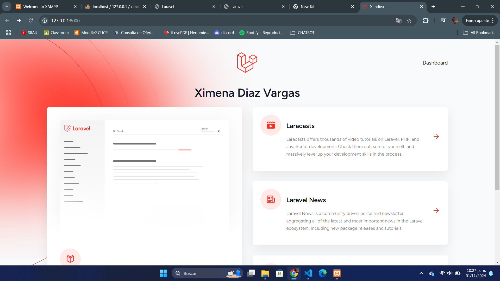
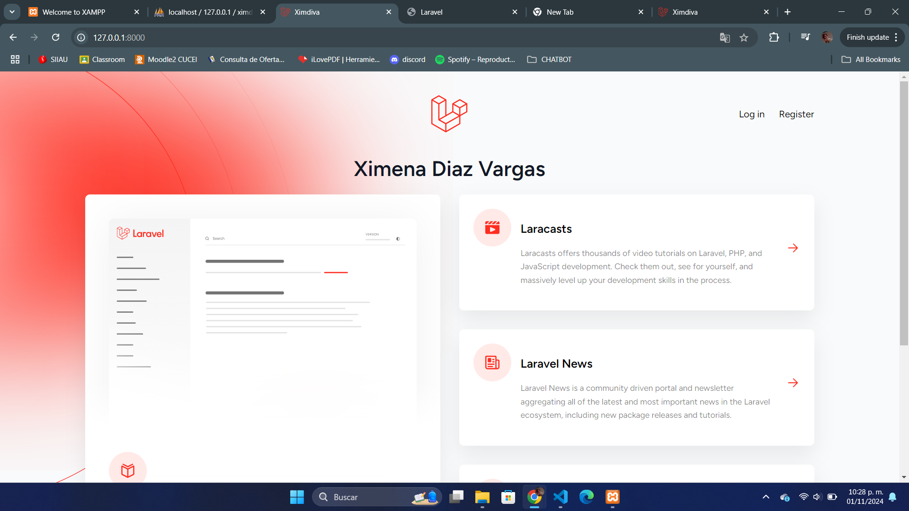
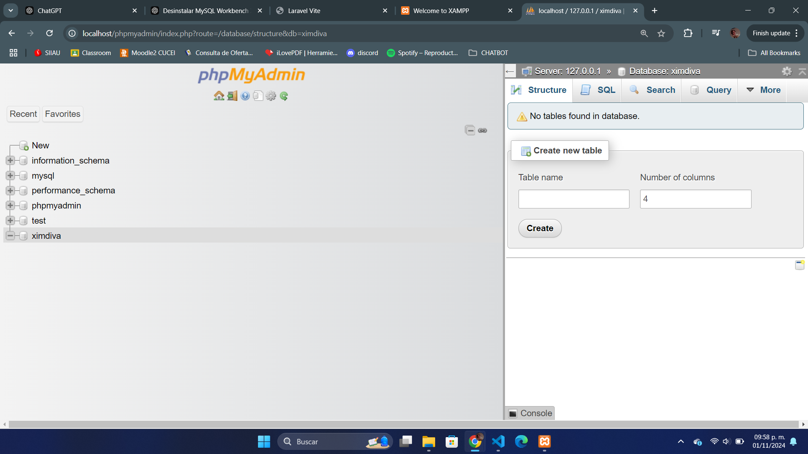
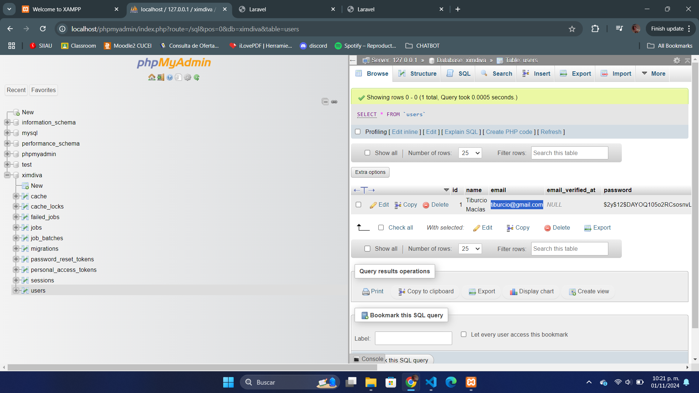
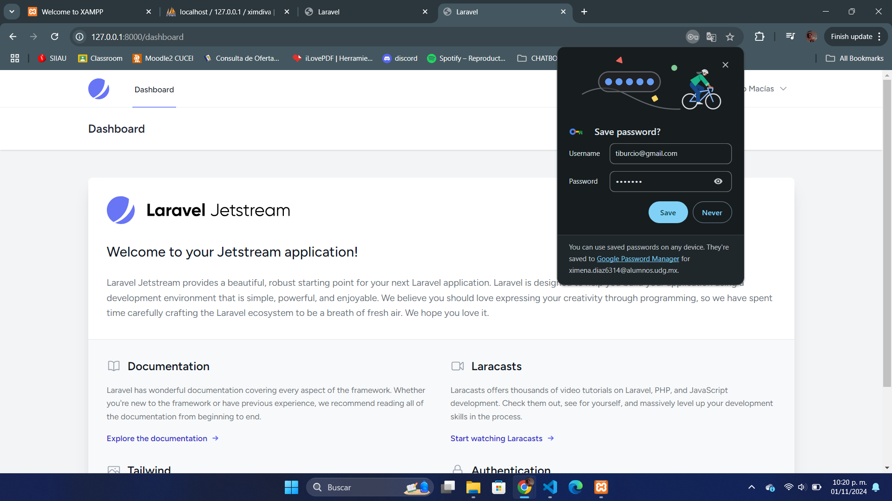
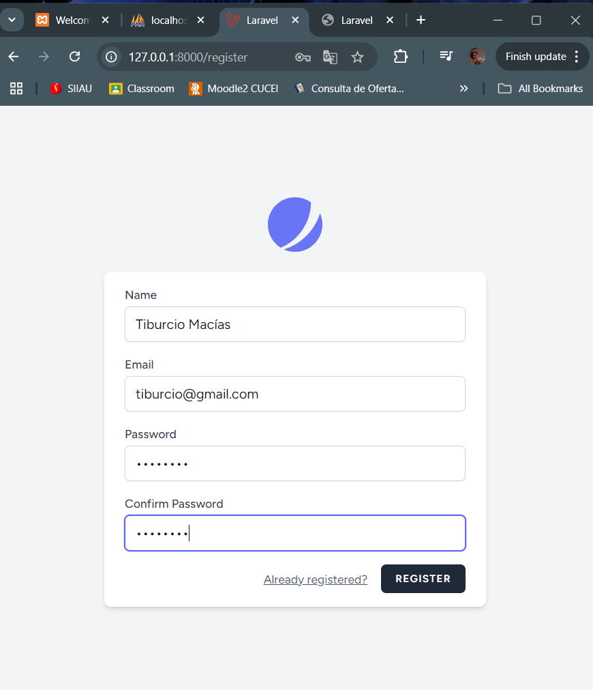
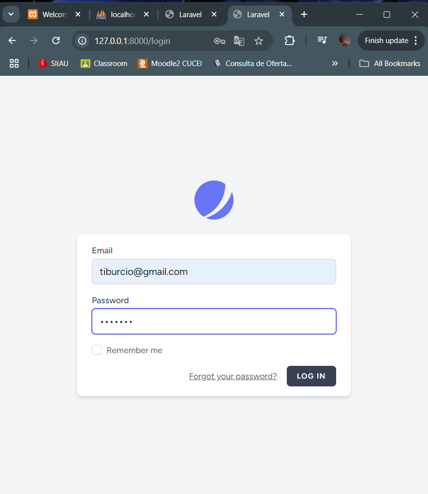

# Mi Aplicación Web en Laravel

---

## Breve Descripción de la Aplicación Web
Esta aplicación web está desarrollada en Laravel y tiene como objetivo principal proporcionar un sistema de registro e inicio de sesión para los usuarios, dicha aplicación está dispuesta a cambios.

---

## Estructura del Proyecto

La estructura del proyecto sigue el patrón MVC (*Modelo-Vista-Controlador*) típico de Laravel. A continuación se presenta una vista simplificada de las carpetas más relevantes:

- **MiProyectoLaravel/**
  - **app/**: Contiene el código fuente de la aplicación.
    - **Http/**: Controladores y Middleware.
    - **Models/**: Modelos de la base de datos.
  
  - **database/**: Archivos de migraciones y semillas.
    - **migrations/**: Migraciones de base de datos.
    - **seeds/**: Archivos de semillas de la base de datos.
  
  - **resources/**: Recursos para la aplicación (vistas, CSS, JS).
    - **views/**: Vistas de la aplicación (Blade templates).
  
  - **routes/**: Rutas de la aplicación.
    - **web.php**: Rutas web.
  
  - **.env**: Configuración del entorno.
  
  - **composer.json**: Dependencias de la aplicación.

---

## Funcionalidades

1. Registro de Usuarios: Los nuevos usuarios pueden registrarse proporcionando su nombre, correo electrónico y contraseña.
2. Inicio de Sesión: Los usuarios pueden iniciar sesión con sus credenciales.
3. Seguridad: La aplicación utiliza características de seguridad de Laravel para proteger las contraseñas y las sesiones de los usuarios.

---

## Dependencias
Las siguientes dependencias son utilizadas en este proyecto:

- **Laravel**: El framework principal que se utiliza para el desarrollo de la aplicación.

- **Jetstream**: Proporciona características de autenticación, registro y gestión de usuarios.

- **Composer**: Gestor de dependencias utilizado para instalar las bibliotecas de PHP.

*Puedes ver todas las dependencias y sus versiones específicas en el archivo composer.json.*

---

## Capturas de Pantalla
A continuación se presentan algunas capturas de pantalla de la aplicación en funcionamiento:

### Captura 1: Inicio de la Aplicación

### Captura 2: Base de Datos

### Captura 3: Dashboard

### Captura 4: Sistema de registro y login

---

## Instrucciones del Cómo Ejecutar la Aplicación

1. Clona este repositorio en tu máquina local.
2. Navega a la carpeta del proyecto en la terminal.
3. Ejecuta composer install para instalar las dependencias.
4. Crea una base de datos en tu servidor local y configura el archivo .env con tus credenciales de base de datos.
5. Ejecuta php artisan migrate para crear las tablas de la base de datos.
6. Inicia el servidor local con php artisan serve.
7. Abre tu navegador y accede a http://localhost:8000 para ver la aplicación en funcionamiento.